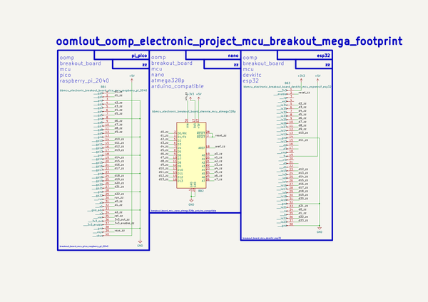
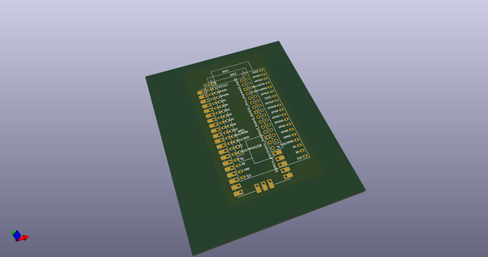
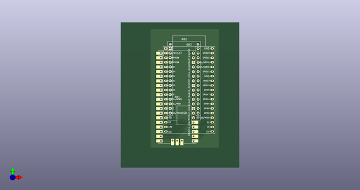
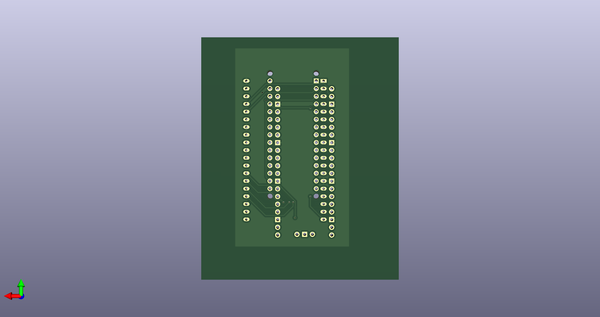
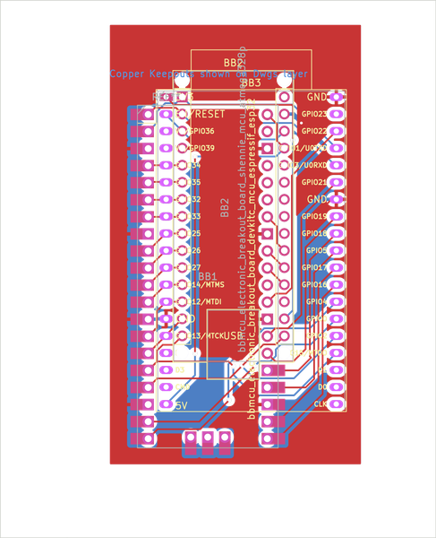

# MCU Breakout Mega Footprint
An MCU Breakout Mega Footprint.
## notes 
### steps
* make the modules
* draw the modules
* incorporate in schematic
* make pcb
* make into footprint
### included footprints  
* arduino nano
  * kicad_module_arduino_nano_withmountingholes
* arduino pro mini 
  * sparkfun_boards_arduino_pro_mini
* raspberry pi pico 2040  
  * arturo182_module_extra_raspberrypi_pico  
* esp wroom 32 devkit c  
  * footprint espressif_espressif_esp32_devkitc  
An MCU Breakout Mega Footprint.  
* ibom github: [ibom github](kicad\current_version\working\bom\ibom.html)
* ibom direct: [ibom direct](https://raw.githack.com/oomlout/oomlout_oomp_electronic_project_mcu_breakout_mega_footprint/main/kicad/current_version/working/bom/ibom.html)

## schematic  
  
[schematic (pdf)](kicad/current_version/working/working_schematic.pdf)  

## pcb  
  
    
  
  
[board (pdf)](kicad/current_version/working/working.pdf)  

## corel working
 

## oomp_parts_summary
| index | designator | quantity | oomp_id | 
| --- | --- | --- | --- | 
| 1 | BB3 | 1 | electronic_breakout_board_devkitc_mcu_espressif_esp32 | 
| 2 | BB1 | 1 | electronic_breakout_board_pico_mcu_raspberry_pi_2040 | 
| 3 | BB2 | 1 | electronic_breakout_board_shennie_mcu_atmega328p_arduino_compatible | 

Search Links: (L) - lcsc, (D) - digikey, (M) - mouser, (N) - newark, (SZ) - szlcsc
note: a work on progress that takes the bom file from kicad pcb and try's to add oomp details

## positions
### top
| # Ref | Val | Package | PosX | PosY | Rot | Side | 
| --- | --- | --- | --- | --- | --- | --- | 
| BB1 | bbmcu_electronic_breakout_board_pico_mcu_raspberry_pi_2040 | bbmcu_electronic_breakout_board_pico_mcu_raspberry_pi_2040 | 60.96 | -71.12 | 0.0 | top | 
| BB2 | bbmcu_electronic_breakout_board_shennie_mcu_atmega328p | bbmcu_electronic_breakout_board_shennie_mcu_atmega328p_arduino_compatible | 57.15 | -44.3881 | 0.0 | top | 
| BB3 | bbmcu_electronic_breakout_board_devkitc_mcu_espressif_esp32 | bbmcu_electronic_breakout_board_devkitc_mcu_espressif_esp32 | 54.745 | -44.3881 | 0.0 | top | 

### bottom
no data
